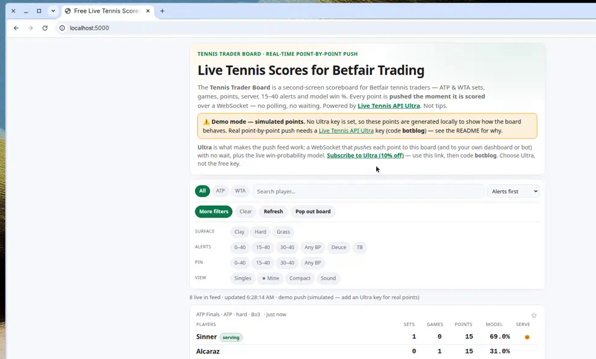

# Tennis Trader Board — live tennis scores for Betfair trading

[](https://github.com/stephanepatteux/live-tennis-scoreboard/actions/workflows/ci.yml)
[](LICENSE)
[](https://www.python.org/)

A self-hosted, real-time **tennis scoreboard built for Betfair tennis traders**.
It shows ATP &amp; WTA **sets, games, points, who is serving, 15–40 / 0–40
break-point alerts**, and a **model win %** next to your ladder — and every point
is **pushed the instant it is scored** over a WebSocket, so there is no polling and
no refresh delay. Perfect as a **second screen** next to Betfair Match Odds. Scores
are informational — **not tips**.

This is the open-source version of the board hosted at
**[botblog.co.uk/tennis-trader-board](https://botblog.co.uk/tennis-trader-board/)**.



> ## ⚡ Real-time push requires a Live Tennis API **Ultra** key
> The point-by-point push feed is an **Ultra-only** capability. Get an Ultra key
> here (affiliate link) and use code **`botblog`** for 10% off:
> **[Subscribe to Ultra](https://affiliates.livetennisapi.com/r/botblog)**.
> _[Why Ultra is required](#why-an-ultra-key-is-required-for-real-time-push) ·
> [Affiliate disclosure](#affiliate-disclosure)._

## Contents

- [Who it's for](#who-its-for)
- [What to expect](#what-to-expect)
- [Why an Ultra key is required](#why-an-ultra-key-is-required-for-real-time-push)
- [Features](#features)
- [Quick start](#quick-start)
- [Configuration](#configuration)
- [Deploy](#deploy)
- [FAQ](#faq)
- [Affiliate disclosure](#affiliate-disclosure) · [Disclaimer](#disclaimer)

## Who it's for

Betfair (and other exchange) **in-play tennis traders** who want a fast, no-frills
**second-screen scoreboard** focused on the moments that move prices — breaks of
serve, 15–40 / 0–40, deuce and tiebreaks — rather than a fan scoreboard. If you
trade tennis Match Odds and want to *see the point before the market reacts*, this
is for you.

## What to expect

**Two modes:**

| Mode | When | What you see |
| ---- | ---- | ------------ |
| **Live push** | You set an Ultra key | Real ATP/WTA matches, each point pushed the instant it is played, with the live model win %. |
| **Demo** | No key set | Locally **simulated** points so you can preview the UI. Clearly labelled; **not real data**. |

**On the board**, each match card shows: the players (with a dot + "serving"
badge on the server), **Sets**, **Games**, **Points** (`0/15/30/40/AD`), the
**Model** win % for each player, and the completed set history. When a game reaches
a trading trigger you get a coloured **alert pill**:

- `0–40` (triple break point) and `AD` break are the hottest;
- `15–40`, `30–40`, any break point, `Deuce`, and `Tiebreak` are also flagged;
- optional **sound** + a toast pop when a new alert fires.

**Trader tools:** filter by **ATP/WTA**, **surface** (clay/hard/grass),
singles-only, a personal **★ watchlist**, and search. Paste **player 1's decimal
odds** and the card shows the gap between the **model %** and the market's
**implied %** in percentage points. **Compact** mode and **Pop out** give you a slim
second-monitor window.

## Why an Ultra key is required for real-time push

**The whole point of this board is that a point appears the moment it is played.**
That "server pushes each point to you" model is only available on Live Tennis API's
**Ultra** plan. Here is exactly why, and why lower tiers can't do it:

### Push vs. polling — two fundamentally different mechanisms

- **Polling (lower tiers): _you_ ask, on a timer.** Free/basic keys expose only the
  REST endpoints (e.g. `GET /matches?status=live`). To follow a match you have to
  call that endpoint again and again on a timer. Between two calls you are blind —
  a break point can come and go before your next request. You also can't call it
  fast: the free plan is capped at **30 requests/min and 100 requests/day**, so
  "every few seconds" burns your quota almost immediately, and you still only see
  the score as it was at each poll, not each point as it happens.
- **Push (Ultra): _the server_ tells you, the instant it changes.** Ultra opens a
  **WebSocket**. You connect once and the server sends you a frame **on every score
  commit** — i.e. on every point — with no request from you and no polling. That is
  the only way to get true point-by-point, zero-delay updates.

### The push feed is gated to Ultra by the API itself

Real-time push is minted through `GET /ws-token`, and that endpoint is documented
as **"Plan required: ULTRA."** With a lower-tier key the token request is rejected
(HTTP 401/403), so **there is no WebSocket to connect to** — it is not a client
setting we can toggle, it's enforced server-side by Live Tennis API. Ultra also
unlocks the **live win-probability model** shown in the board's Model column.

### This board is push-only on purpose

There is **no 8-second polling fallback**. Without an Ultra key the board runs in a
clearly-labelled **demo mode** that generates fake points locally so you can preview
the interface — it is not real data. Add an
[Ultra key](https://affiliates.livetennisapi.com/r/botblog) (code `botblog`) and the
board connects to the Ultra WebSocket and shows real matches, point by point.

> **No API key ships with this project.** This repository contains **no key at
> all** — not even a hidden or example one. You buy your own Live Tennis API Ultra
> key and supply it at runtime via the `LIVE_TENNIS_API_KEY` environment variable
> (kept in an untracked `.env`, never committed). Until you do, the board stays in
> demo mode.

```
Browser ── SSE /api/tennis/stream ──▶ this app ── WebSocket ──▶ Live Tennis API Ultra
   ▲ each point pushed downstream                 (GET /ws-token → connect → subscribe)
   └───────────────  no polling, no timers  ───────────────────┘
```

The app maintains one upstream Ultra WebSocket and fans each point out to every
connected browser over Server-Sent Events. Your **API key stays on the server** —
it is sent to Live Tennis API as an `Authorization: Bearer` header and is never
exposed to the browser or committed to this repo.

## Features

- Real-time point-by-point push (Ultra) with live break-point alerts: `0–40`,
  `15–40`, `30–40`, any break point, deuce, tiebreak — with pinning, a sound cue,
  and toast notifications.
- ATP / WTA filter, surface (clay / hard / grass), singles-only, search, and a
  personal ★ watchlist.
- Paste **player 1's decimal odds** to see the gap between the model win % and the
  market's implied % (in percentage points).
- Compact mode + **Pop out** for a slim second-monitor window (`?embed=1`).

## Quick start

```bash
python3 -m venv .venv
source .venv/bin/activate
pip install -r requirements-dev.txt

cp .env.example .env      # add your LIVE_TENNIS_API_KEY (Ultra) for real push
python wsgi.py            # → http://127.0.0.1:5000
```

- **With an Ultra key** in `.env`, the board connects to the Ultra WebSocket and
  pushes real points.
- **With no key**, it runs in **demo mode** (simulated points) so you can preview
  the UI. Demo is not real data.

Run the tests with `pytest`.

## Configuration

All configuration is via environment variables — see [`.env.example`](.env.example):

| Variable                  | Default                                       | Purpose                                                        |
| ------------------------- | --------------------------------------------- | -------------------------------------------------------------- |
| `LIVE_TENNIS_API_KEY`     | _(blank → demo mode)_                          | Your Live Tennis API **Ultra** key. Server-side only.          |
| `LIVE_TENNIS_API_BASE`    | `https://api.livetennisapi.com/api/public/v1` | API base URL (`/ws-token` is minted from here).                |
| `LIVE_TENNIS_API_TIMEOUT` | `10`                                          | Token-mint / connect timeout (seconds).                        |
| `MODEL_FALLBACK`          | `1`                                           | Fill the Model column with a local estimate when a frame has none. |
| `DEMO_POINT_INTERVAL`     | `1.0`                                         | Demo mode only: seconds between simulated points.              |
| `HOST` / `PORT`           | `127.0.0.1` / `5000`                          | Dev server bind.                                               |
| `FLASK_DEBUG`             | `0`                                           | `1` enables Flask auto-reload.                                 |

## Deploy

The board uses long-lived Server-Sent Events, so run a worker class that supports
concurrent streaming connections (threads or gevent), for example:

```bash
gunicorn wsgi:app --bind 0.0.0.0:5000 --worker-class gthread --threads 16 --workers 1
```

Set `LIVE_TENNIS_API_KEY` (Ultra) in the host environment — never in the repo. Use a
single worker (or a shared broker) so one upstream Ultra WebSocket is shared; see
[`docs/OPERATIONS.md`](docs/OPERATIONS.md).

## FAQ

**Is this a Betfair betting bot?** No. It is a **read-only scoreboard**. It shows
live scores, break-point alerts and a model win % so you can trade manually on
Betfair. It never places bets and is not a Betfair API key.

**How is it different from Flashscore / BBC live tennis scores?** Fan scoreboards
show results. This is built for **Betfair tennis trading**: who is serving, 15–40 /
0–40 break-point alerts, ATP/WTA filters, a model win % vs your odds, and a compact
second-screen view.

**Do I need an API key?** For **real** live scores, yes — a
**[Live Tennis API Ultra](https://affiliates.livetennisapi.com/r/botblog)** key
(use code `botblog`; the push feed is Ultra-only). Without a key the board runs in demo mode with
simulated points. See [Why Ultra is required](#why-an-ultra-key-is-required-for-real-time-push).

**Why not just poll every few seconds?** Polling misses the exact moment a point
lands and burns rate-limited quota. The Ultra WebSocket pushes **every point** with
no delay — this board is push-only by design.

**Can I filter for 15–40 and other break points?** Yes — 0–40, 15–40, 30–40, any
break point, deuce and tiebreak, with pinning and an optional sound alert.

**Can I open it on a second monitor?** Yes — use **Compact** and **Pop out** for a
slim window (`?embed=1`).

**Is my API key safe?** Yes. It is read from the environment server-side and sent to
Live Tennis API as a header; it is never sent to the browser and never committed.

## Affiliate disclosure

Links to Live Tennis API on this page are affiliate links: if you subscribe through
them (optionally with code `botblog`), this project may earn a commission at no
extra cost to you. You can also sign up directly at
[livetennisapi.com](https://livetennisapi.com).

## License

Released under the [MIT License](LICENSE) — free to use, modify, and self-host.

## Disclaimer

Not financial advice. Live scores and model win probability are informational only.
They are not tips and do not place bets for you.
